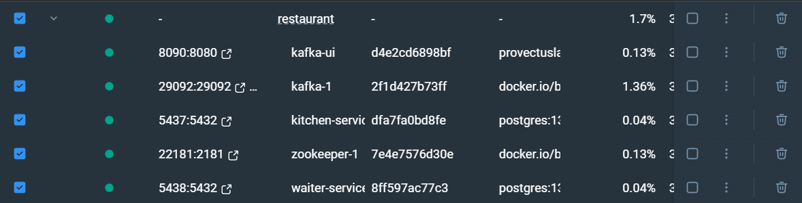
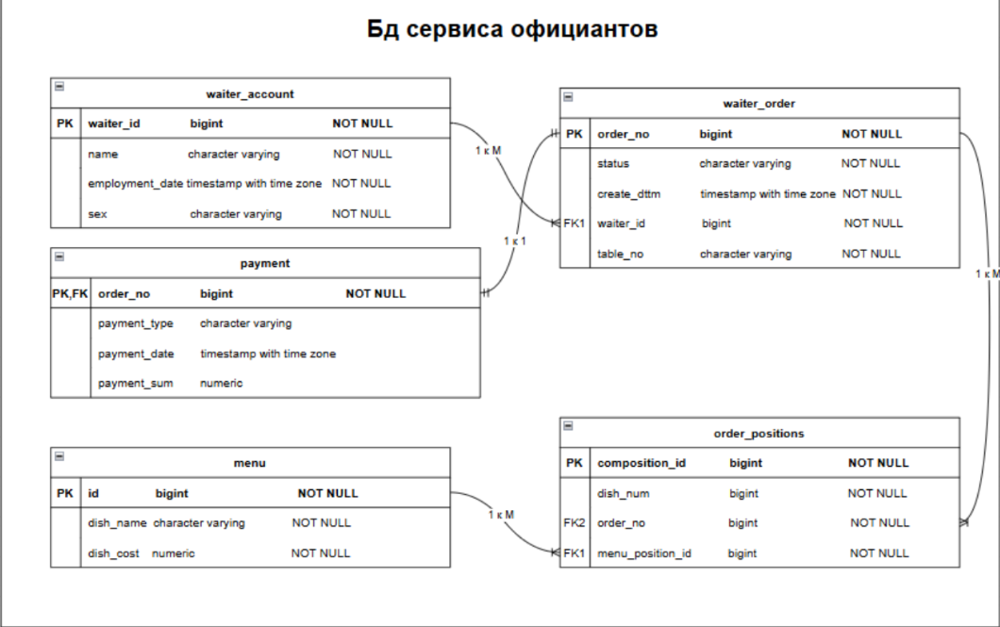
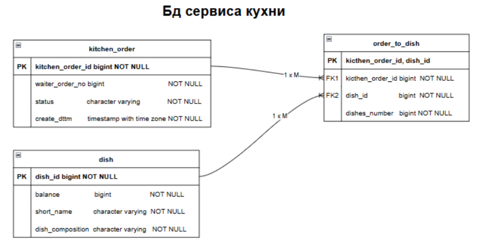

# Многомодульный проект "Ресторан"
Реализована микросервисная архитектура, представляющая собой взаимодействие сервисов кухни и официантов для обработки заказов.

Проект разработан в рамках стажировки в "Лиге цифровой экономики".

Взаимодействие между модулями:
* waiter-service -> kitchen-service - Kafka
* kitchen-service -> waiter-service - OpenFeign
## Структура проекта
Проект состоит из 3-х модулей:
* dependencies-bom - модуль, содержащий необходимые зависимости и их версии.
* waiter-service - сервис официантов.
* kitchen-service - сервис кухни
## Стек технологий
* **Java** (JDK 21)
* **Spring Boot** (ver. 3.4.3)
* **Maven** 
* **Liquibase** (ver. 4.31.1)
* **PostgreSQL** (ver. 13.3)
* **Spring Data JPA**
* **MyBatis** (ver. 3.0.4)
* **OpenFeign**
* **Kafka** (ver. 2.5.2)
* **Swagger**
* **jUnit, Mockito**

## Запуск приложения
Для начала работы выполните следующие шаги:
1. Клонируйте репозиторий на свой ПК
2. Запустите [docker/docker-compose.yml](docker/docker-compose.yml)*
3. Соберите проект: `mvn clean install`
4. Запустите [WaiterServiceApplication.java](waiter-service/src/main/java/ru/liga/waiterservice/WaiterServiceApplication.java), [KitchenServiceApplication.java](kitchen-service/src/main/java/ru/liga/kitchenservice/KitchenServiceApplication.java)

* Проверьте, чтобы все контейнеры были запущены:

## Тестирование приложения
Сервисы можно протестировать при помощи Swagger UI и Postman
* [Swagger UI для kitchen-service](http://localhost:8081/swagger-ui/index.html#)
* [Swagger UI для waiter-service](http://localhost:8082/swagger-ui/index.html#)
* [Postman для kitchen-service](kitchen-service/src/main/resources/kitchen-service.postman_collection.json)
* [Postman для waiter-service](waiter-service/src/main/resources/waiter-service.postman_collection.json)

## Схема БД

## Реализованные запросы
### waiter-service:
* [WaiterOrderController](waiter-service/src/main/java/ru/liga/waiterservice/controller/WaiterOrderController.java)
  * `GET /order` получить все заказы
  * `PUT /order` обновить данные о заказе
  * `POST /order` создать заказ
  * `GET /order/{id}` получить заказ по id
  * `GET /order/status/{id}` получить статус заказа
* [KitchenOrderController](waiter-service/src/main/java/ru/liga/waiterservice/controller/KitchenOrderController.java)
  * `POST /kitchen` отправить заказ на кухню
### kitchen-service:
* [KitchenOrderController](kitchen-service/src/main/java/ru/liga/kitchenservice/controller/KitchenOrderController.java)
  * `GET /order` получить все заказы
  * `PUT /order/{id}/{status}` обновить статус заказа

## Алгоритм работы приложения
* waiter-service:
  1. Официант формирует новый заказ
  2. По запросу заказ отправляется в брокер сообщений (kafka; waiter-service выступает в роли Producer'a)
* kitchen-service:
  4. Кухня считывает поступившие заказы из брокера сообщений (kafka; kitchen-service - Consumer)
     * Если позиции из заказа имеются на кухне, то статус заказа меняется на `APPROVED`
     * Если позиции из заказа имеются на кухне, то статус заказа меняется на `REJECTED`
  5.  Обновленные данные о заказе сразу отправляются в waiter-service при помощи OpenFeign.
      
  (*)   Если кухня обновит статус заказа, то будет действие аналогично пункту 5.
* waiter-service:
  6. С кухни приходят обновленные данные о заказе
  7. В waiter-service сохраняются данные о заказе.

## Статусы заказа
Для waiter-service, order-service имеются следующие статусы заказов:
* `NEW` новый заказ
* `IN_PROCESSING` заказ в обработке (отправлен на кухню)
* `APPROVED` заказ принят
* `REJECTED` заказ отклонен
* `READY` заказ готов
